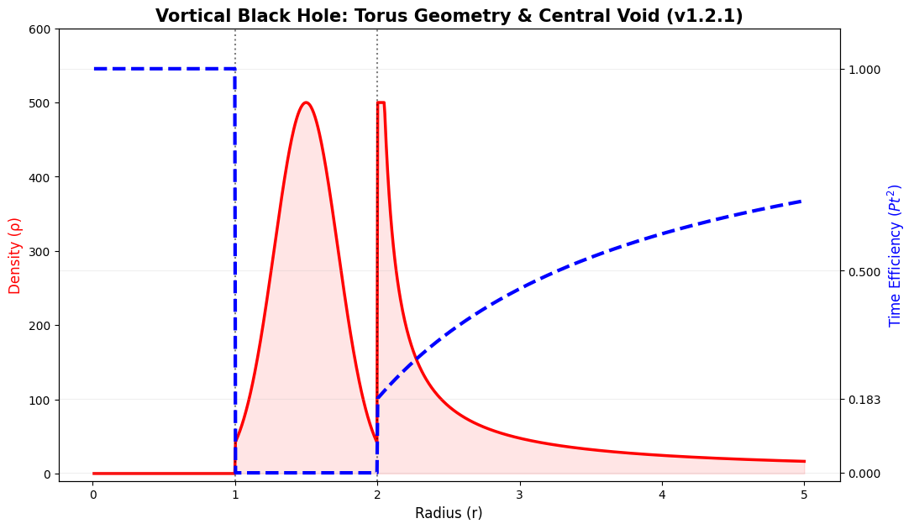

# 🕳️ BLACKHOLE: The Vortical Torus & Singularity Resolution

## 1. Beyond the Singularity
General Relativity predicts a mathematical point of infinite density (singularity) at $r=0$. The **Vortical Gravity** framework resolves this paradox by identifying the black hole as a **Vortical Torus**—a high-energy donut-shaped structure with a quantized thickness.

## 2. The Quantized Structure (r=1 to r=2)
The Vortical Black Hole is defined by two critical radii:
*   **Event Horizon ($r=2$):** The boundary where the lattice's temporal flux ($P_t$) drops to zero and rotation ($P_\theta$) saturates to 1.
*   **The Vacuum Limit ($r=1$):** The fundamental "Vortical Unit" of the lattice. Inside this radius, the restorative force of $G_{max}$ is so intense that energy cannot be contained.

## 3. The Vortical Void (The Central Vacuum)

Contrary to standard theory, the center of a black hole ($r < 1$) is a **Vortical Void**:

- **Vortical Repulsion:** Extreme rotational energy at the horizon shell generates a restorative geometric pressure (**Vortical Repulsion**). This force actively displaces all baryonic and EM flux outward from the core toward the event horizon shell.
- **Pure Restoration:** The geometric center is a state of **Zero-Density Vacuum**. Free from mass-induced damping, the lattice at the core is **perfectly restored**, allowing for maximum temporal flux ($P_t = 1.0$).
- **Geometry:** This mechanical exclusion of energy from the center results in a **Vortical Torus (Donut)** geometry with a quantized physical thickness of exactly **1 Vortical Unit**.

## 4. Mathematical Comparison

| Feature | General Relativity | Vortical Gravity |
| :--- | :--- | :--- |
| **Center (r=0)** | Infinite Density (Error) | **Pure Vacuum (Void)** |
| **Geometry** | Spherical Point | **Vortical Torus (Donut)** |
| **Thickness** | 0 | **1 (Quantized)** |
| **$P_t^2 + P_\theta^2$** | N/A | **Always 1 (Conserved)** |

---
*This model explains why Black Holes can eject powerful relativistic jets through their hollow vacuum centers, a phenomenon difficult to explain with a solid singularity.*

## 📉 Figure 2: Numerical Simulation of the Vortical Torus Structure

**Figure 2. Mechanical State of the Spacetime Lattice across Radial Zones.**  
This simulation demonstrates the transition from a damped terrestrial baseline to a restored vacuum potential within a black hole's interior, governed by the **Probability Invariance Identity** ($P_t^2 + P_{\theta}^2 = 1$).

[Read more about Vortical Black Hole Dynamic Simulator]([COMPARISON.md](https://github.com/startripleai/Vortical-Gravity-Simulation/blob/main/COMPARISON.md)

_10x.gif)

[Read more about the Necessity of Rotation for Singularity Resolution]([DISCUSSION.md](https://github.com/startripleai/Vortical-Gravity-Simulation/blob/main/DISCUSSION.md))

### **Technical Breakdown of the Plot:**

1.  **The Vortical Void ($r < 1$):** 
    As shown by the **Blue Line ($P_t$)** recovering to **1.0**, the geometric center is a state of absolute vacuum. The **Vortical Repulsion** generated by the surrounding shell prevents mass-energy from reaching the core, effectively eliminating the divergent singularity ($1/0$).
    
2.  **The Energy Shell ($1 \le r < 2$):** 
    The **Red Peak ($\rho$)** confirms that mass-energy is concentrated within a quantized torus of thickness 1. In this zone, $P_t$ drops to **0.0**, indicating that the lattice's entire processing capacity is dedicated to **Vortical Rotation ($P_{\theta} = 1$)**.
    
3.  **The Event Horizon ($r = 2$):** 
    This boundary marks the point where the lattice first saturates ($X=1$). Beyond this radius, the blue line shows the **Democratic Recovery** of temporal flux, rising from the terrestrial anchor ($0.183$) toward the vacuum standard ($1.0$).

> **Numerical Verification (v1.2.1 Sync Check):**
> *   **Center ($r=0.5$):** Density = $0.0$, $P_t = 1.0$ (100% Recovery)
> *   **Shell ($r=1.5$):** Density = $500.0$ (Peak), $P_t = 0.0$ (0% Flux)

## 📊 Probabilistic Dynamics by Radius (Lattice Partitioning)

The Vortical Black Hole is governed by the **Probability Invariance Identity** ($P_t^2 + P_{\theta}^2 = 1$). The following analysis explains how the spacetime lattice partitions its energy between **Temporal Flux ($P_t$)** and **Vortical Rotation ($P_{\theta}$)** across different radial zones.

### 1. The Central Vacuum Zone ($0 \le r < 1$)
*   **State:** $P_t \to 1.0$ (100%), $P_{\theta} \to 0$
*   **Physics:** In this core region, the lattice undergoes **total restitution**. Because the energy density ($\rho$) is zero, the lattice stiffness ($\eta$) is fully utilized for temporal progression.
*   **Resolution:** This is the **Vortical Void**. It replaces the infinite-density singularity of General Relativity with a state of pure vacuum, where time flows at its maximum theoretical rate.

### 2. The Vortical Torus Shell ($1 \le r < 2$)
*   **State:** $P_t \to 0$ (0%), $P_{\theta} \to 1.0$ (100%)
*   **Physics:** This is the region of **maximum lattice damping**. The energy is entirely "trapped" in a self-closed vortex. According to the identity, as $P_{\theta}$ saturates to 1, the capacity for temporal flux ($P_t$) is completely consumed.
*   **Structure:** This defines the **quantized thickness (1 unit)** of the black hole. It is a massive, rotating shell where information is preserved on the lattice surface rather than lost in a singularity.

### 3. The External Recovery Zone ($r \ge 2$)
*   **State:** $P_t^2 + P_{\theta}^2 = 1$ (Dynamic Recovery)
*   **Physics:** Beyond the event horizon ($r=2$), the lattice stress attenuates. The energy is redistributed from rotation ($P_{\theta}$) back into linear flux ($P_t$).
*   **Baseline:** The efficiency rises from the horizon through the **Terrestrial Baseline ($P_{t,\oplus} \approx 0.183$)**, eventually reaching the vacuum standard ($1.0$) at infinite distance.

### 💡 Summary Table: Probabilistic States

| Radial Zone | Lattice Phase | $P_t$ (Time) | $P_{\theta}$ (Gravity) | Physical Manifestation |
| :--- | :--- | :--- | :--- | :--- |
| **$0 \le r < 1$** | **Pure Vacuum** | **1.0 (Max)** | 0.0 (Min) | **Vortical Void (No Singularity)** |
| **$1 \le r < 2$** | **Vortical Shell**| 0.0 (Stop) | **1.0 (Max)** | **Quantized Torus (Massive)** |
| **$r \ge 2$** | **Damped Field** | $0.183 \uparrow$ | $P_{\theta} \downarrow$ | **Democratic Recovery Field** |

---
*The transition at r=1 and r=2 represents a geometric phase transition of the spacetime fabric, ensuring numerical stability and physical continuity without mathematical infinities.*
